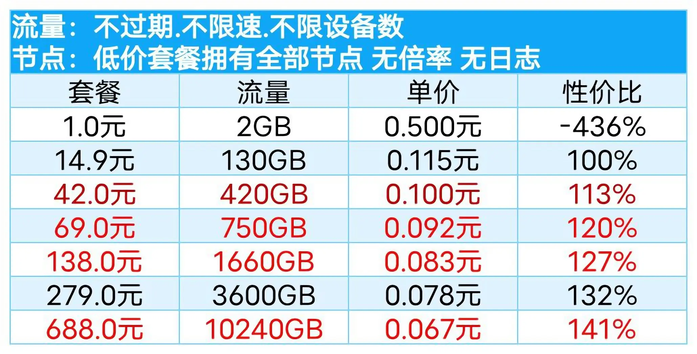

### 注：本人使用推荐(按我的使用时间排序)，不对问题负责，自行抉择(2025.08.10更新)

### 一、魔戒(2021.10使用至今|已购10T不限时，备用中)
平价，按量付费，速度尚可，多中转

链接：[mojie.kim](https://mojie.kim/register?aff=zBuQHqPk)

### 二、八戒(2023.02使用至今|已购390G不限时)
贵，按量/周期，港日美新等专线，速度上佳，貌似送中节点

链接：[bajie.xyz](https://bajie.xyz/#/register?code=WIzk3Sw0)

### 三、Kitty(2025.06.28使用至今|已购36两年，混用中)
周期付费，价格便宜，速度尚可，订阅偏简陋

128G每月|¥24一年¥36两年、512G每月|¥15季付¥50年付、1024G每月|¥9月付¥90年付

链接：[kitty.ceo](https://kitty.ceo/#/register?code=MARAkheO)

### 四、无名国度(1元特价混用中)
便宜，按量/周期，速度不错，流量较多，节点分倍率，低倍率节点反应略慢速度拉满

周期: 特价最多1t限节点|¥1每月、最多3.6t/¥3每月、最多15t|¥9每月、最多100t|¥29每月、最多500t/¥99每月

按量 50G(5T)|¥19

链接: [untitled.xxmad.com](https://untitled.xxmad.com/auth/register?code=SWFecLiq)

### 五、便宜机场(白嫖混用中)

便宜，按量/周期，应该23年末开的，每月可免费50G(限速80mbps)，速度尚可

周期：50G每月|¥0(限速)、100G每月|¥13年付、500G每月|¥14季付¥55年付、1000G每月|¥10月付¥100年付

- 按量：100G|¥10、5000G|¥45、1000G|¥85

- 链接：[xn--wtq35pfyd55o.co](https://xn--wtq35pfyd55o.co/#/register?code=wsCjg20P)

### 弃用
免费机场(不再便宜)、glados(禁止下载跑满宽带,300mbps半小时即封,限制访问网站)
