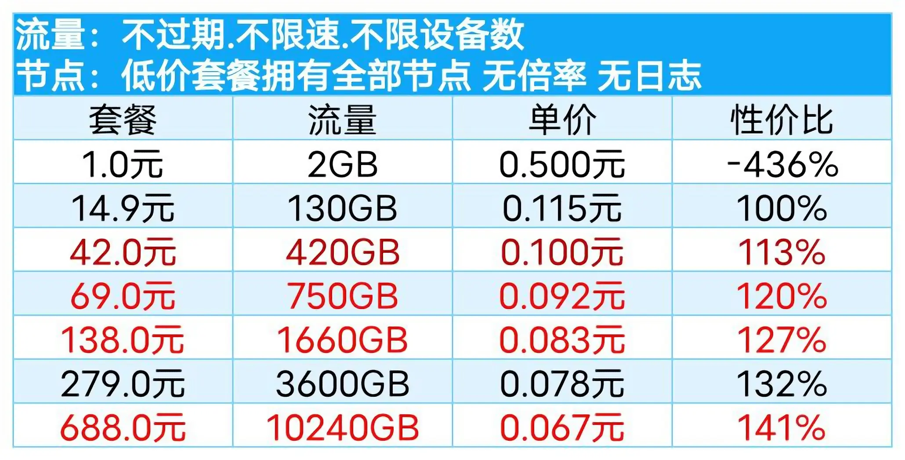
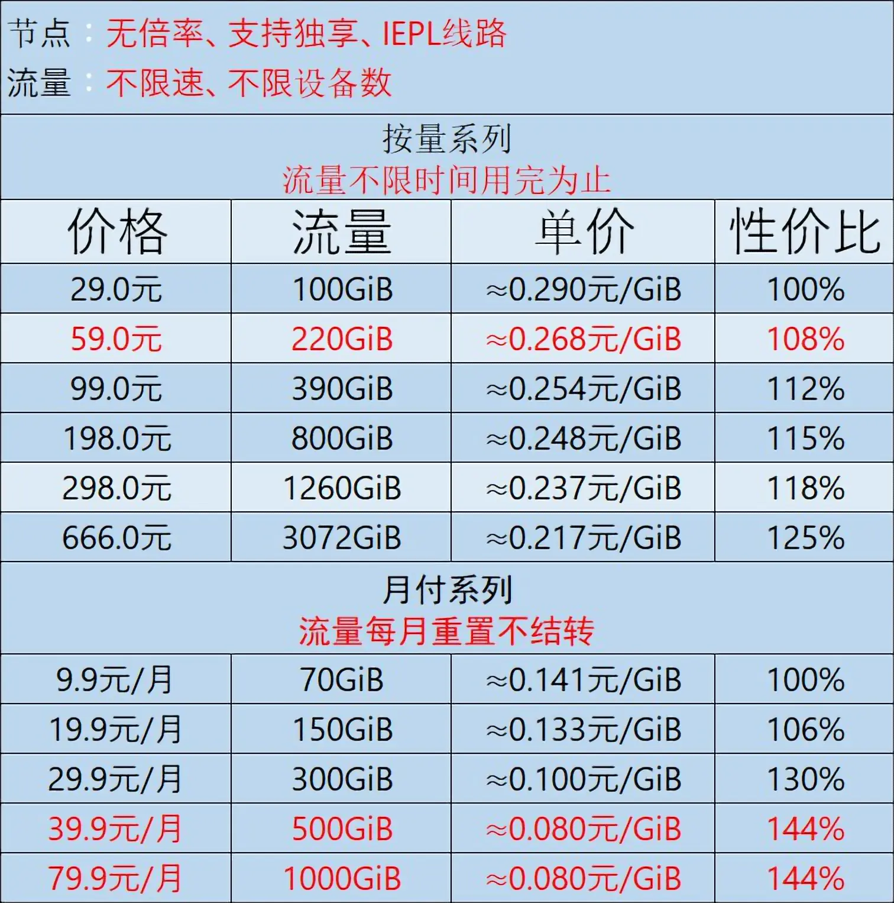

### 注：本人使用中推荐(部分仅测试)，出问题不负责，自行抉择(2025.08.10更新)

### 一、魔戒(2021.10使用至今|已购10T不限时)
平价，按量付费，速度尚可，多中转

链接：[mojie.kim](https://mojie.kim/register?aff=zBuQHqPk)

### 二、八戒(2023.02使用至今|已购390G不限时)
贵，按量/周期，港日美新等专线，速度上佳，貌似送中节点

链接：[bajie.xyz](https://bajie.xyz/#/register?code=WIzk3Sw0)

### 三、Kitty(2025.06.28使用至今|已购36两年)
周期付费，价格便宜，速度尚可，订阅偏简陋

128G每月|¥24一年¥36两年、512G每月|¥15季付¥50年付、1024G每月|¥9月付¥90年付

链接：[kitty.ceo](https://kitty.ceo/#/register?code=MARAkheO)

### 四、无名国度(仅一元测试)
便宜，按量/周期，速度不错，流量较多，节点分倍率

周期: 特价最多1t限节点|¥1每月、最多3.6t/¥3每月、最多15t|¥9每月、最多100t|¥29每月、最多500t/¥99每月

按量 50G(5T)|¥19

链接: [untitled.xxmad.com](https://untitled.xxmad.com/auth/register?code=SWFecLiq)

### 弃用
免费机场(不再便宜)、glados(禁止下载跑满宽带,300mbps半小时即封,限制访问网站)
