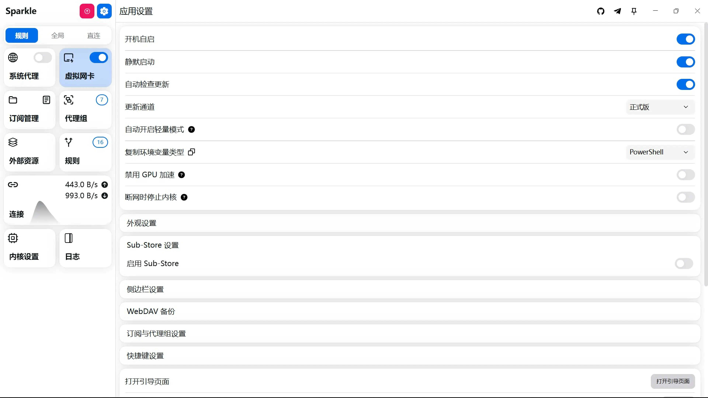
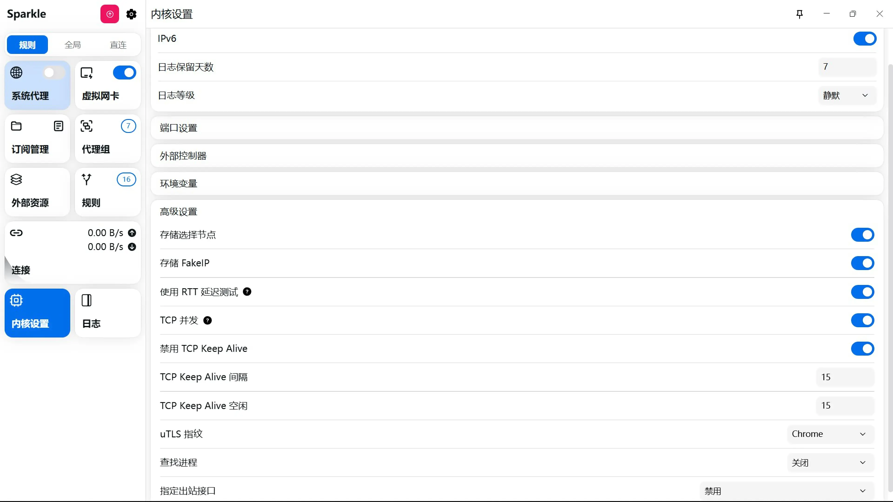

ps: 配置优先配合模板，尽可能减少覆写

## 自用

模板: https://raw.githubusercontent.com/echs-top/proxy/main/mihomo.yaml

机场: https://github.com/echs-top/proxy

## [Android] Clash Meta For Android 配置参考

https://github.com/MetaCubeX/ClashMetaForAndroid/releases

|  |  |
| ----------- | ----------- |

## [Windows] Sparkle 配置参考

https://github.com/xishang0128/sparkle/releases

|  |
| ----------- |
|  |
|  |
|  |
